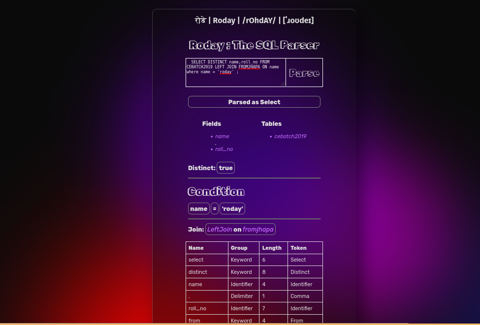

<center>
<h1>रोडे | Roday | /rOhdAY/ | \[ˈɹoʊdeɪ\] </h1>
<h3 style="font-style:italic">Parsing scripts, a coder's endeavor, Roday Parser dances, parsing's true treasure.</h3>
</center>

Roday is simple SQL Parser written in Rust and served on the Web with awesomeness of Webassembly.

### Steps to Build

```
wasm-pack build --no-typescript --release --target web 

python -m http.server 80 
```

## Demo is Live on [voidash.github.io/SQL-parser](https://voidash.github.io/SQL-parser)



### If Anurag types

```
select beautiful_girls from computer_engineering where SEM = 1;
```

Then the scanner will have 

```
[
        Symbol { name: "select", len: 6, token: Select, group: Keyword },
        Symbol { name: "beautiful_girls", len: 15, token: Identifier, group: Identifier },
        Symbol { name: "from", len: 4, token: From, group: Keyword },
        Symbol { name: "computer_engineering", len: 20, token: Identifier, group: Identifier },
        Symbol { name: "where", len: 5, token:j Where, group: Keyword },
        Symbol { name: "sem", len: 3, token: Identifier, group: Identifier },
        Symbol { name: "=", len: 1, token: EQ, group: Operator },
        Symbol { name: "1", len: 1, token: Identifier, group: Identifier },
        Symbol { name: ";", len: 1, token: Semicolon, group: Delimiter }
]
```

### Parsing Grammar

> Aru garna alchi lagyo so leaving this checkbox, in case i want to add some features

-   ✅ Select
-   ❌ CreateDatabase
-   ❌ CreateTable
-   ❌ InserInto
-   ❌ DropTable
-   ❌ DropDatabase


EBNF of Select
```
<select-statement> -> "SELECT" ["DISTINCT"] ["TOP" <u32>] ["(" <get-id-list> ")" | <get-id-list> ] "FROM" <get-id-list> [ <join-type> <identifier> "ON" <identifier> ] "WHERE"  "identifier" <operation> "identifier" ;

<join-type> ->   "INNER JOIN" | "FULL OUTER JOIN" | "LEFT JOIN" | "RIGHT JOIN" 

// curly brackets is a Kleene-star which can repeat one or more times
<get-id-list> -> <identifier>  {"," <identifier>} 

<identifier> ->  '*' | <alpha> { <alphanumeric> | "_" | "-" }  

<operation> -> "<>" | "=" | ">" | "<" 

<alpha> ->  
    "a" | "b" | ... | "z" | "A" | "B" | ... | "Z"

<alphanumeric> -> 
    <alpha> | <digit>

<digit> ::=
    "0" | "1" | "2" | "3" | "4" | "5" | "6" | "7" | "8" | "9"

```